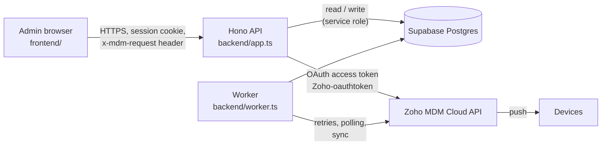
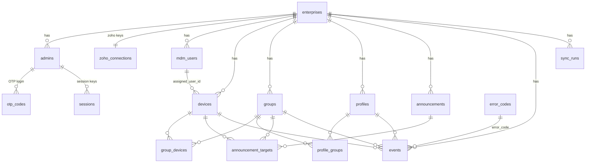
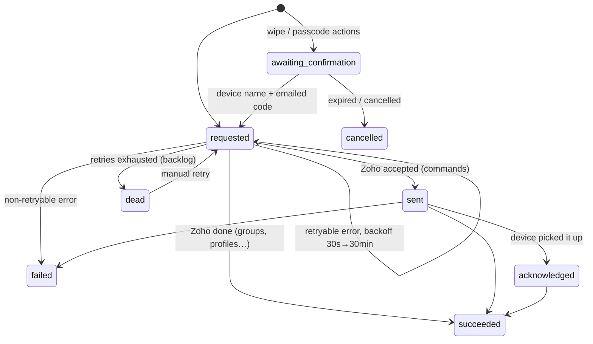

# MDM Console — Zoho MDM integration + dashboard

Multi-enterprise dashboard on top of **Zoho / ManageEngine MDM Cloud**, built from the
`MDM_Dev_Guide.pdf` API reference and the design notes.

- **Backend:** Deno + Hono, function-based modules (no classes)
- **Frontend:** plain HTML, CSS and ES-module JavaScript (no framework, no build step)
- **Database:** Supabase (PostgreSQL) — `database/schema.sql`
- **Zoho:** OAuth 2.0 per enterprise, REST calls to `https://mdm.manageengine.<dc>/api/v1/mdm`

## What it does

| From the notes | Where |
|---|---|
| Register an enterprise locally with its admin | `POST /api/auth/register` |
| Local login (OTP, no passwords) | `POST /api/auth/otp` → `POST /api/auth/verify` |
| Connect the enterprise's Zoho account | Settings → *Connect with Zoho* (OAuth) or *Self Client* |
| Add devices to department / function groups | Devices → *Add to group*, Groups → *Add devices* |
| Profiles with restrictions, kiosk, passcode + wipe-after-N-failures, FRP | Profiles → *New profile* |
| Assign devices → groups, profiles → groups | Groups page |
| Profile → device directly: **not allowed** | `POST /api/devices/:id/profiles` returns `DIRECT_PROFILE_DEVICE_BLOCKED` |
| Remove a group from a profile | Group → Profiles → *Remove* (`POST /api/groups/:id/profiles/remove`) |
| Fetch logs & history | Activity & logs, Backlog, device → *Load command history from Zoho* |
| Announcements (added) | Announcements page — create, send to groups/devices, delivery status |
| Monitoring: security alerts, location, geofences, suspicious activity (added) | Alerts, Locations, Settings → Monitoring |

> Zoho has no public API to create a Zoho organisation or its directory admin. Create the Zoho MDM
> account (and admin) in Zoho, then connect it here. Everything after that is automated.

## Architecture



- **Zoho = source of truth** for device state; the worker syncs it into Supabase every 15 min (and on *Sync now*).
- **Supabase** keeps what Zoho doesn't: enterprises/admins/sessions, group *kind* (department/function),
  the event log, announcements, sync runs.
- Every change made in Zoho is an **event**: written first, executed, retried, and visible in the logs.

## Data model (ER)



How the notes map to tables:

| Node in notes | Table | Foreign keys |
|---|---|---|
| Enterprise accounts (name, email, OTP login, session keys, zoho keys, user id) | `enterprises`, `admins`, `otp_codes`, `sessions`, `zoho_connections` | `admins.enterprise_id`, `otp_codes.admin_id`, `sessions.admin_id`, `zoho_connections.enterprise_id` |
| Devices (dev id, Apple/Android, name, model, zoho key, added date) | `devices` | `enterprise_id`, `assigned_user_id → mdm_users` |
| Users (username, dev id, zoho key, date added) | `mdm_users` | `enterprise_id`; the device link is `devices.assigned_user_id` because one user can hold several devices |
| Groups (group id, name, zoho key, devices id) | `groups` + `group_devices` | `groups.enterprise_id`; `group_devices.group_id`, `group_devices.device_id` |
| Profiles (profile id, name, zoho key, state, last sync, group id) | `profiles` + `profile_groups` | `profiles.enterprise_id`; `profile_groups.profile_id`, `profile_groups.group_id` — no profile→device table, by design |
| Events (event id, zoho keys, action, profile id, state, action time) | `events` | `enterprise_id`, `admin_id`, `device_id`, `group_id`, `profile_id`, `announcement_id`, `error_code → error_codes` |
| Failure handling (backlogs, error codes + messages) | `events.state='dead'`, `error_codes`, `sync_runs` | |

Every "zoho key (enterprise)" in the notes became `enterprise_id` → `enterprises(id)`; the actual Zoho
credentials exist once, encrypted, in `zoho_connections`.

## Event state machine (commands, retries, backlog)



- **Idempotency:** the browser sends an `Idempotency-Key` per user action; a repeat returns the original
  event (unique index `events(enterprise_id, idempotency_key)`), so a retry never sends two wipes.
- **Writes are not auto-retried inside the HTTP call** (Zoho has no idempotency keys). Retries happen through
  the queue; create operations first look for an existing item with the same name before creating again.
- **Two-step confirmation** for `complete_wipe`, `corporate_wipe`, `reset_passcode`, `clear_passcode`:
  one device at a time, owner role for wipes, confirm by typing the exact device name **and** a 6-digit code
  emailed to the requester. Unconfirmed requests expire after 10 minutes.
- **Acknowledgement:** after `sent`, the worker polls `/devices/{id}/commandhistory` with growing intervals.

## Security

| Concern | Implementation |
|---|---|
| Zoho tokens & client secrets | AES-256-GCM encrypted (`ENCRYPTION_KEY`), decrypted only in memory; access tokens cached ≤1 h |
| Admin login | Passwordless OTP, 10-min expiry, 5 attempts, 5 codes / 15 min, stored as HMAC |
| Session keys | 256-bit random token in an `HttpOnly; SameSite=Strict` cookie; only its SHA-256 is stored; revocable |
| CSRF | SameSite=Strict + mandatory `x-mdm-request` header on every write |
| Tenant isolation | Every query filters by the session's `enterprise_id`; ids from the browser are re-checked |
| Roles | `owner` (Zoho connect, wipes, deletes) · `admin` (groups, profiles, commands) · `viewer` (read-only, IMEI/serial masked) |
| Personal device data | IMEI/serial masked for viewers; location fetched live, never stored, every view audited; logs redact tokens/IMEI |
| OAuth redirect | single-use `state` (10 min), Zoho data-centre allow-list |
| Browser hardening | strict CSP (no inline script/style), frame-ancestors none, no innerHTML with data |
| Database | RLS enabled on all tables with no policies → the public anon key reads nothing |

Under Tanzania's Personal Data Protection Act (2022), tell employees what is collected (device
identifiers, location on request) and agree a retention period for `events` and `sync_runs`.

## Setup

1. **Supabase:** create a project → SQL editor → run `database/schema.sql`, then `database/002_monitoring.sql`, then `database/003_profile_group_sync.sql`.
2. **Zoho client** (api-console.zoho.com): *Server-based Applications* client, redirect URI
   `http://localhost:8000/api/zoho/callback` (your `APP_URL` + `/api/zoho/callback`). Optional — each
   enterprise can instead use its own *Self Client* from Settings.
3. **Environment:** `cp .env.example .env`, fill it in; `deno task keygen` twice for `ENCRYPTION_KEY`
   and `HASH_PEPPER`.
4. **Run:** `deno task dev` → open http://localhost:8000. With `MAIL_PROVIDER=console` the OTP code is
   printed in the terminal.
5. Register the enterprise → sign in → Settings → *Connect with Zoho* → *Sync now*.
6. Production: `APP_ENV=production`, HTTPS, `MAIL_PROVIDER=zeptomail` (Zoho ZeptoMail, or `resend`), and run `deno task worker` as a separate process (set `RUN_WORKER_INLINE=false`).

Tasks: `deno task dev | start | worker | check | test | keygen`.

## API

All responses are `{ "data": … }` or `{ "error": { "code", "message", "retryable" } }`. Operations
return **200** when finished and **202** when queued, waiting for a device, or awaiting confirmation.

| Method & path | Role | Purpose |
|---|---|---|
| `POST /api/auth/register` · `/otp` · `/verify` · `/logout`, `GET /api/auth/me` | public / any | Enterprise + admin, OTP sign-in |
| `GET /api/admins`, `POST /api/admins` | admin / owner | List / invite admins |
| `GET /api/zoho/status`, `POST /api/zoho/connect`, `GET /api/zoho/callback`, `POST /api/zoho/self-client`, `/test`, `/disconnect` | owner | Zoho connection |
| `GET /api/overview`, `POST /api/sync`, `GET /api/sync-runs` | any / admin | Counters, sync |
| `GET /api/devices`, `GET /api/devices/:id`, `/:id/history`, `/:id/location`, `GET /api/devices/actions` | any / admin | Inventory and Zoho history |
| `POST /api/commands`, `POST /api/commands/:id/confirm` | admin (wipe: owner) | Device actions |
| `GET/POST /api/groups`, `GET/DELETE /api/groups/:id`, `POST /api/groups/:id/devices`, `DELETE /api/groups/:id/devices/:deviceId`, `POST /api/groups/:id/profiles`, `POST /api/groups/:id/profiles/remove` | admin | Groups, membership, profile association |
| `GET /api/profiles/catalog`, `GET/POST /api/profiles`, `POST /api/profiles/:id/policies`, `/:id/publish`, `DELETE /api/profiles/:id` | admin | Profiles |
| `GET /api/apps` | any | Zoho app repository (kiosk picker) |
| `GET/POST /api/announcements`, `POST /:id/send`, `GET /:id/status`, `DELETE /:id` | admin | Announcements |
| `GET /api/events`, `/backlog`, `/:id`, `POST /:id/retry`, `/:id/cancel` | any / admin | Logs, history, backlog |
| `GET/PUT /api/monitoring/settings`, `GET /api/monitoring/rules`, `PUT /api/monitoring/rules/:key`, `POST /api/monitoring/scan`, `GET /api/monitoring/zoho-compliance` | any / owner / admin | Monitoring settings, alert rules, run detectors now |
| `GET /api/alerts`, `POST /api/alerts/:id/acknowledge`, `POST /api/alerts/:id/resolve` | any / admin | Alerts |
| `GET /api/locations/latest`, `GET /api/locations/device/:id?hours=`, `GET/POST /api/locations/geofences`, `PATCH/DELETE /api/locations/geofences/:id` | admin | Locations (audited) and geofences |

## Project layout

```
database/schema.sql          tables, FKs, enums, indexes, RLS, worker functions, error codes
backend/
  main.ts  worker.ts  app.ts  config.ts
  lib/        errors (codes + messages), crypto, db, log (redaction), validate
  zoho/       client (tokens, retries, pagination), api (endpoints from the guide), payloads (profile builders)
  services/   auth, zoho-connect, events (queue), commands, groups, profiles, announcements, sync, lookup, mail
  middleware/ auth (session, roles, CSRF, rate limit, idempotency)
  routes/     one file per area
  tests/      unit tests (no DB needed)
frontend/
  index.html  styles.css  js/api.js  js/ui.js  js/app.js  js/views/*.js
```

## Monitoring

Run `database/002_monitoring.sql` once. The worker then:

- **Security scan** (every sync interval, per device): reads `security`, `network` and last-contact from
  Zoho, stores a snapshot in `device_snapshots`, and raises or **auto-resolves** alerts.
- **Location polling** (only if the owner turned tracking on): corporate devices only, every N minutes,
  optionally only in working hours (enterprise timezone), stored in `device_locations`, **purged after the
  retention period** (default 30 days). Geofences are evaluated on the newest point.
- **Admin activity**: failed sign-in bursts, sign-ins from new IPs, wipe-confirmation brute force.

| Rule | Severity (default) | Trigger | Auto-action options |
|---|---|---|---|
| `device_rooted` | critical | Zoho reports the device rooted / jailbroken | lock, lost mode, alarm |
| `passcode_missing` | warning | No screen lock | lock |
| `passcode_noncompliant` | warning | Passcode below the profile | — |
| `storage_unencrypted` | info (off) | Storage encryption off | — |
| `device_offline` | warning | No contact for `offline_hours` (48 h) | — |
| `device_unenrolled` | critical | Device disappears from Zoho (reset / unenrolled) | — |
| `data_spike` | warning | Mobile data per hour > `data_spike_factor` × the device's normal (idle periods ignored) | — |
| `geofence_exit` | warning | Outside every allowed fence that applies | lock, lost mode, alarm |
| `geofence_restricted` | critical | Inside a restricted fence | lock, lost mode, alarm |
| `admin_failed_logins` | warning | ≥ 5 wrong sign-in codes in 15 min | — |
| `admin_new_ip` | info | Admin signs in from an IP not seen in 30 days | — |
| `wipe_confirmation_failed` | critical | Wipe / passcode request cancelled after 5 wrong confirmations | — |

- One open alert per condition (`dedupe_key`); repeats increase `occurrences`. When the condition clears,
  the alert resolves itself (`resolved_by` empty = system).
- Auto-actions go through the normal events queue (logged, retried, idempotent per alert) and run **once**
  per alert. Critical alerts are emailed to owners/admins (ZeptoMail).
- **Privacy:** tracking is off until the owner confirms employees were informed (timestamp stored);
  personal/work-profile phones are never tracked; only owners/admins can view locations; every view is
  logged; retention purge runs every 6 h. Geofences are drawn on a built-in map (no third-party tiles),
  with "Open map" links to OpenStreetMap.
- Zoho's own fence policies (`/compliance`) are listed read-only; fences in this platform are evaluated by
  the worker so they work without configuring Zoho's geofencing.

## Profiles assigned in the Zoho console

The MDM API lets you assign and unassign profiles to a group (`POST`/`DELETE /groups/{id}/profiles`) but documents no way to *read* which profiles a group has. Sync handles this in two ways:

1. **Direct:** it first tries `GET /groups/{id}/profiles`. If Zoho answers, that list is the source of truth and replaces the group's links (shown as **from Zoho**).
2. **Detected:** if Zoho rejects that call, sync reads `GET /devices/{id}/profiles` for each group's devices. A profile that every device in the group has is linked to the group (shown as **detected**). The missing endpoint is re-tried once a day.

Limits of detection: a group with no devices can't be detected; a profile that hasn't reached every device yet appears only after it has; and if a device sits in two groups, a profile from one group can look like it belongs to the other when every device in that second group also has it. Links assigned from this console are never removed by detection. `profile_groups.source` records where each link came from (`platform`, `zoho`, `inferred`).

## Interface

The console follows the Black Swan brand: Soft Ivory pages, a Charcoal sidebar, white cards with Muted Stone dividers, Burnt Copper only for active states and progress. Headings use Parkinsans, everything else 42dot Sans, both self-hosted in `frontend/fonts/` (SIL OFL) so the strict `'self'` CSP still holds. No letter-spacing is applied anywhere.

- **Navigation** is grouped: Monitor (Overview, Alerts, Locations), Manage (Devices, Groups, Profiles, Announcements), Records (Activity, Settings). The top bar has device search, the Zoho connection status and Sync now.
- **Overview** opens with a five-step setup checklist (connect Zoho → sync → create group → publish profile → assign to group) until all steps are done.
- **Devices and groups have their own pages** (`#/devices/<id>`, `#/groups/<id>`) instead of pop-ups, so they can be linked and bookmarked. Destructive device actions sit apart in their own section.
- **Activity** has an All / Backlog tab (`#/backlog` still works). **Settings** is split into Zoho connection, Monitoring, Team and Sync history tabs.
- **Phones (≤900px)**: a bottom tab bar (Overview, Alerts, Devices, Groups, More), the sidebar becomes a drawer, tables turn into stacked cards and dialogs become bottom sheets. No horizontal scrolling at 390px.

## Notes and limits

- Restriction values follow the guide's field tables: most fields use `1 = allow, 0 = restrict`; camera,
  video and audio use `1 = allow, 2 = restrict`. Extend `ANDROID_RESTRICTIONS` in `zoho/payloads.ts` for more.
- Kiosk uses the fields that are fully legible in the guide; other kiosk fields can be passed via `extra`.
- The guide doesn't document command status codes; outcomes are read from `status_description`
  ("Command Success", failures) in command history.
- Profile ↔ group links are recorded when made through this app; links created directly in the Zoho
  console are not imported by sync (Zoho's list endpoints don't return them).
- iOS: the same model works once APNs / Apple Business Manager are set up in Zoho; use the *custom*
  profile purpose with iOS payload names (`restrictionspolicy`, `passcodepolicy`).
